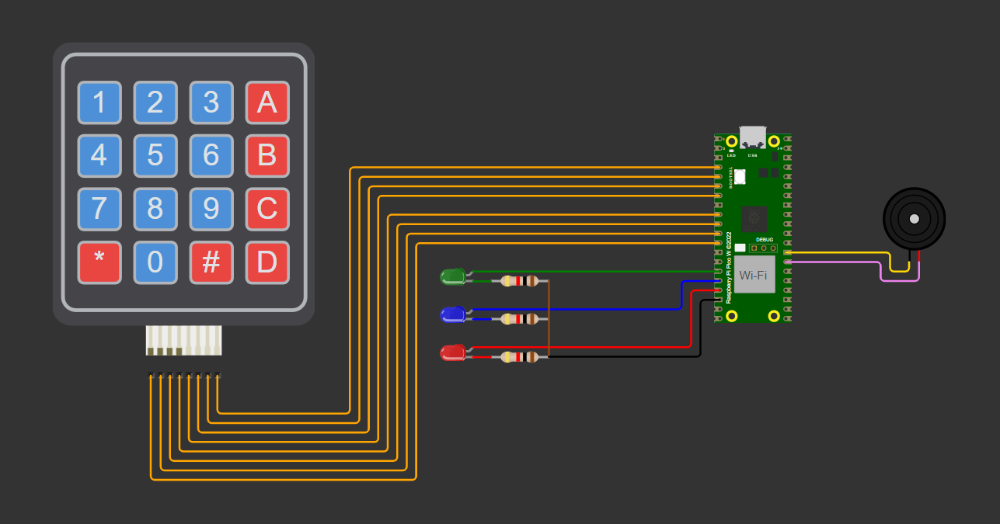
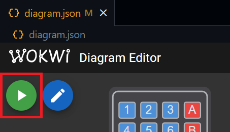

# Controlando LEDs e buzzer via teclado matricial com o RP2040

## 💡 O que é este projeto?

Este é um firmware escrito em C para controlar três LEDs e um buzzer conectados aos pinos GPIO de um RP2040 na placa de desenvolvimento Raspberry Pi Pico W, por meio de um teclado matricial 4x4.

## ⚡ Diagrama do hardware

Os componentes são conectados de acordo com o esquema abaixo:

## 🎞️ Vídeo de demonstração do projeto

Uma demonstração do projeto em funcionamento pode ser assistida no link abaixo:

https://drive.google.com/file/d/1rnurJKT9977FYmhDQLbK1D5Y6VO_LB9R/view

## 🔎 Quais recursos estão disponíveis?

Por meio do teclado, o usuário pode realizar as seguintes ações:

1. Ligar o LED vermelho enquanto a tecla `A` estiver pressionada;
2. Ligar o LED azul enquanto a tecla `B` estiver pressionada;
3. Ligar o LED verde enquanto a tecla `C` estiver pressionada;
4. Ligar todos os LEDs enquanto a tecla `D` estiver pressionada;
5. Ligar o buzzer enquanto a tecla `#` estiver pressionada;

Observações:

- Quando nenhuma das teclas acima está pressionada, todos os periféricos são desligados.
- Pressionar outras teclas não tem efeito no circuito ou no firmware.

## 🛠 Quais são os pré-requisitos para executar o projeto?

A configuração sugerida para executar o projeto é:

1. Ter o [Pico SDK](https://github.com/raspberrypi/pico-sdk) instalado na sua máquina;
2. Ter o [ARM GNU Toolchain](https://developer.arm.com/Tools%20and%20Software/GNU%20Toolchain) instalado na sua máquina;
3. Ter o [Visual Studio Code](https://code.visualstudio.com/download) instalado na sua máquina;
4. Ter este repositório clonado na sua máquina;
5. Ter as seguintes extensões instaladas no seu VS Code:
- [C/C++](https://marketplace.visualstudio.com/items?itemName=ms-vscode.cpptools);
- [CMake](https://marketplace.visualstudio.com/items?itemName=twxs.cmake);
- [CMake Tools](https://marketplace.visualstudio.com/items?itemName=ms-vscode.cmake-tools);
- [Raspberry Pi Pico](https://marketplace.visualstudio.com/items?itemName=raspberry-pi.raspberry-pi-pico);
- [Wokwi Simulator](https://marketplace.visualstudio.com/items?itemName=Wokwi.wokwi-vscode).

No Linux, GCC e Make normalmente já estão disponíveis de forma nativa.

## 💻 Como executar a simulação?

Com os pré-requisitos atendidos, siga os passos a seguir:

1. Utilize o VS Code para abrir a pasta raiz do projeto clonado:

2. Clique em "Compile", à direita da barra de status e aguarde o processo:

3. Abra o arquivo `diagram.json` e clique no botão de play para iniciar a simulação:

4. Quando a simulação iniciar, pressione os botões do teclado matricial para testar o firmware.

## 👥 Colaboradores do projeto

Participantes do projeto por ordem alfabética e atividades desenvolvidas:

### Líder

#### Edeilton da Silva de Oliveira
- Responsável pela documentação, testes e gestão da equipe

### Desenvolvedores

#### Cibelle Sousa Rodrigues
- Responsável pelo desenvolvimento do diagrama do circuito

#### Edemir de Carvalho Rodrigues
- Responsável pelo acionamento do buzzer

#### Gustavo Oliveira Alves
- Responsável pelo acionamento individual dos LEDs

#### Joabis Oliveira dos Santos Júnior
- Responsável pelo acionamento simultâneo dos LEDs

#### Rogério Silva Palafoz Júnior
- Responsável pelo mapeamento do teclado matricial

## ✨ Recursos para versionamento e correção de bugs

### Conventional Commits

Conventional Commits seguem uma estrutura fixa como feat, fix, docs e style, o que facilita identificar o escopo das mudanças. Isso ajuda a organizar o histórico e facilita o versionamento (por exemplo, ao definir o número da próxima versão do software).

### Labels no repositório

As labels em pull requests ajudam a identificar o escopo das tarefas. Nesse projeto, utilizamos:

- `bugfix`: para correção de bugs
- `concluído`: para indicar uma issue já resolvida
- `documentação`: para indicar melhorias ou inclusões na documentação
- `readonly`: para indicar informação ou histórico
- `novidade`: para indicar a implementação de uma nova feature
- `pendência`: para indicar uma tarefa que ainda precisa ser feita
- `teste`: para indicar testes de recursos do código ou do processo

### Branches nomeadas segundo o escopo

A nomeação de branches como `feature/...`, `docs/...` ou `bugfix/...` organiza o fluxo de trabalho e indica o propósito da branch, facilitando o entendimento. Portanto, foi um recurso adotado durante o desenvolvimento do projeto.

### Diretivas de pré-processamento

Neste projeto, utilizamos as diretivas para definir os pinos associados aos LEDs e ao buzzer. Os LEDs verde, azul e vermelho estão configurados nos pinos 11, 12 e 13, respectivamente, enquanto o buzzer está conectado ao pino 21. Isso facilita identificar e alterar pinos conforme necessário.